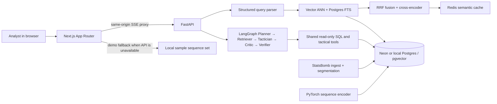

# HalfSpace

Football analytics workbench. The monorepo contains a Next.js product UI, a FastAPI retrieval and dossier service, a StatsBomb open-data pipeline, a PyTorch sequence encoder, and a dependency-free tracking artifact contract for precomputed broadcast analysis.

The current public demo is intentionally honest: the bundled records are **SAMPLE DATA** and are not reconstructed from broadcast video. The tracking package in `tracking/` defines the production boundary for calibrated pitch coordinates, confidence, tracked/interpolated/lost ball states, team metadata, player roles, and evaluation annotations. It does not claim detector accuracy until an annotated broadcast clip is supplied.

Generate the deterministic, explicitly labeled sample artifact used for contract
development with:

```bash
/usr/bin/python3 -m tracking.sample --output artifacts/sample-tracking.json
```

This command creates sample data only; it is not a broadcast detector and must not
be used as a tracking-quality result.

## Run the demo from a fresh clone

Requires Docker Compose. The UI includes a local sample corpus, so its search, pitch selection, compare, dossier, trace, and evidence replay flows work without credentials.

```sh
git clone https://github.com/cax6505/HalfSpace.git
cd HalfSpace
make demo-up
```

Open [http://localhost:3000](http://localhost:3000). The demo stack starts Postgres with pgvector, Redis, FastAPI, and Next.js. Live retrieval and generated dossiers require an `OPENAI_API_KEY` and an ingested/indexed corpus; without those, the UI clearly marks sample mode and remains interactive.

For local web development, run `cd apps/web && npm ci`, then run `npm run dev` from the repository root (or `make web`). Start the API with Python 3.12 and `make api`; `make test` runs API unit tests, `make e2e` runs Playwright browser flows, and `make eval-gate` validates the checked-in evaluation fixtures. `make ingest` loads the configured StatsBomb competitions. See [architecture](docs/ARCHITECTURE.md), [design rules](docs/DESIGN.md), and [evaluation details](docs/EVALS.md).

## Product walkthroughs


## Architecture



The search workspace (`/`) streams parse and retrieval stages, allows edits to all six parsed filters, and links result focus to the pitch. Playback spans the selected possession with up to eight seconds of lead-in and immediate response around possession changes; frame labels show the event and regain/loss transition. Select two sequences to compare; use the per-result similar action to start exemplar retrieval. Search query, filters, selected sequence, and comparison IDs are serialized in the URL. Teams shown in sample mode come from loaded sample metadata; there is no club-specific default.

The dossier workspace (`/dossier`) streams LangGraph trace steps and latency, and opens each claim in an evidence drawer with a sequence replay. The Next route handlers proxy SSE to FastAPI at runtime using `API_URL`, so Vercel and the local Docker web container do not require browser CORS configuration.

## Design decisions

- CSS variables in `apps/web/app/globals.css` are the source of truth for color, type, 8 px spacing, motion durations, and easing. `tailwind.config.ts` maps those values to utility tokens.
- The pitch uses the StatsBomb 120 × 80 coordinate space. Live events use their source coordinates; play direction is normalized from possession team and period; arrows require a source pass/carry/shot endpoint. Playback includes the full selected possession with up to eight seconds before and after it. Available StatsBomb 360 snapshots supply observed player positions and visible-area polygons. Matches without tracking are labeled as event-location playback. Sample open play and corners show a longer illustrative sequence, not match tracking. SVG keeps markings and markers crisp; the activity heatmap uses a DPR-scaled canvas.
- The search interface stays keyboard-first: `⌘K`/`Ctrl+K`, editable native filter controls, visible focus rings, and reduced-motion support. No component library is used.
- Playback advances with `requestAnimationFrame`, pauses when offscreen, and transitions marker positions at frame boundaries. The trace and claim evidence IDs stay visible as analyst-facing context.
- Sample records are deterministic UI fixtures, never presented as live retrieval results. API-returned dossier claims still pass through the evidence verifier before the endpoint emits the final report.
- Tracking artifacts are JSON-serializable `tracking/v1` records. `tracking.metrics.evaluate_ball` reports precision, recall, mean position error, and tracked percentage when ground truth is present. `tracking.postprocess.postprocess_ball` rejects impossible speed jumps and only interpolates bounded gaps; it never fabricates coordinates for an unbounded loss.

## Evaluation snapshot

| Evaluation | Current result | Notes |
|---|---:|---|
| Playwright core flows | 2 / 2 passed locally | Search/filter/select/compare and dossier claim replay |
| Lighthouse performance | 100 / 100 | Desktop Chrome, production build, `/` sample mode |
| Lighthouse accessibility | 100 / 100 | Desktop Chrome, production build, `/` and `/dossier` |
| 201 mounted-player frame sample | 16.67 ms mean / 16.70 ms p95 | Headless Chrome rAF sample with all sample players visible and playing |
| Search cached-cold p95 | Not measured | Requires a configured model, Redis, indexed corpus, and representative workload |
| Retrieval accuracy / recall | Not measured | See the measured-vs-pending tables in [EVALS.md](docs/EVALS.md) |

CI runs API unit tests, the 100-query fixture contract gate, the Next production build, and Playwright E2E. If `OPENAI_API_KEY` is configured in GitHub Actions, CI also runs Promptfoo's live parser regression; retrieval relevance and latency still need a labeled, reachable corpus. No search latency SLA is claimed from sample mode.

## Deploy

**Web on Vercel:** create a Next.js project with root directory `apps/web`, connect the repository, and set `API_URL` to the deployed FastAPI base URL. The included `apps/web/vercel.json` uses the standard Next.js build.

**API on Fly.io:** provision a Postgres service with pgvector and Redis, then from `services/api` run `fly launch --copy-config --no-deploy` or create the app named in `fly.toml`; set `DATABASE_URL`, `REDIS_URL`, and `OPENAI_API_KEY` with `fly secrets set`, then deploy. The API initializes its schema on startup. Point Vercel's `API_URL` at the Fly HTTPS URL.

For local containers, `docker compose down` stops services and retains the Postgres volume. `docker compose down -v` removes local database data.

## Limitations

- Fresh-clone sample mode is an interaction demo, not a substitute for match data, embeddings, or a model key.
- Search p95 under 1.5 seconds has not been established against a real corpus or cache workload. LLM parsing, embedding, cold model loading, database size, and provider latency affect that measurement.
- The xT and 360-frame pitch-control tools are explicitly heuristic/snapshot estimates. Broadcast ball/player tracking metrics remain unmeasured until an annotated clip is available; no detector score is invented from the sample fixtures.
- Deployment manifests provide a starting configuration. Each deployment still needs its own app names, secrets, hosted database, and Redis endpoint.

## Other workspaces

See [ml/README.md](ml/README.md) for InfoNCE training, ONNX export, pgvector indexing, and the model evaluation workflow. Python 3.12 and Node.js 20+ are the supported local toolchain.
